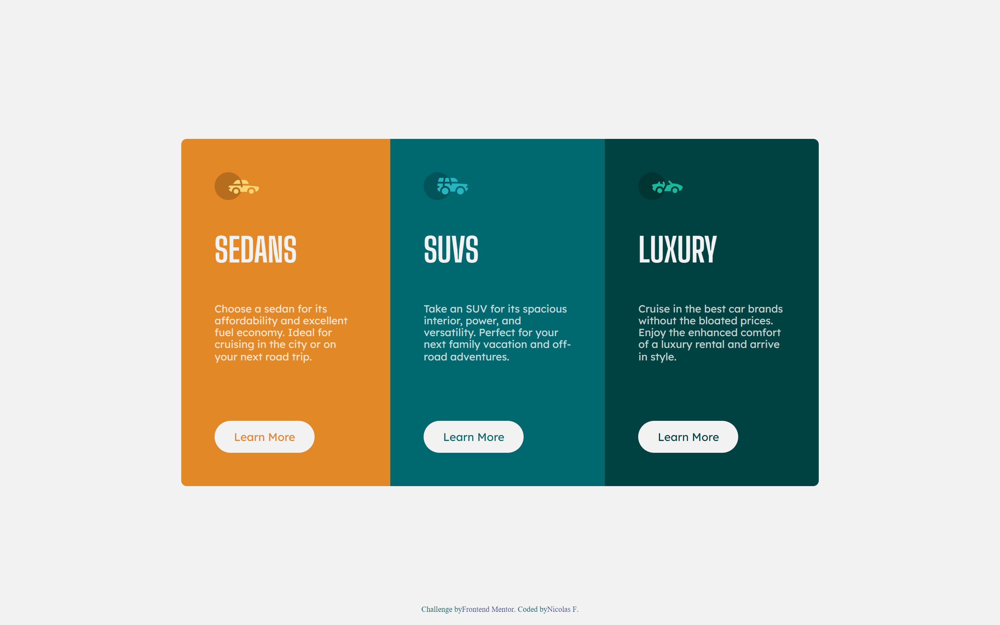
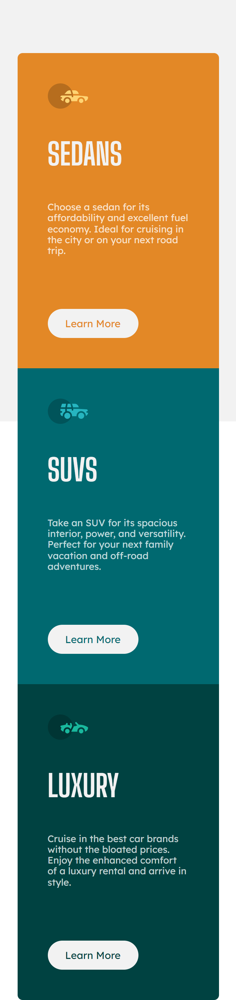

# Frontend Mentor - Four card feature section solution

This is a solution to the [Design preview for the 3-column preview card component coding challenge](https://www.frontendmentor.io/challenges/3column-preview-card-component-pH92eAR2). Frontend Mentor challenges help you improve your coding skills by building realistic projects.

## Table of contents

- [Overview](#overview)
  - [The challenge](#the-challenge)
  - [Screenshot](#screenshot)
  - [Links](#links)
- [My process](#my-process)
  - [Built with](#built-with)
  - [What I learned](#what-i-learned)
  - [Continued development](#continued-development)
  - [Useful resources](#useful-resources)
- [Author](#author)
- [Acknowledgments](#acknowledgments)

## Overview

### The challenge

Users should be able to:

- Your challenge is to build out this 3-column preview card component and get it looking as close to the design as possible.

### Screenshots

#### Desktop

#### Mobile

### Links

- Solution URL: [Code](https://github.com/nicolasfig/3-column-preview-card-component)
- Live Site URL: [Live site](https://nicolasfig.github.io/3-column-preview-card-component/)

## My process

### Built with

- Semantic HTML5 markup
- CSS custom properties
- Flexbox

### What I learned

Hoy to position multiple flex containers, how to add a border to a button

### Useful resources

- [Flexbox Malven](https://flexbox.malven.co/) - Useful flexbox reference as always
- [MDN](https://developer.mozilla.org/en-US/) - MDN the best documentation

## Author

- Frontend Mentor - [@nicolasfig](https://www.frontendmentor.io/profile/nicolasfig)
